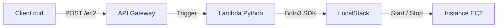

# ☁️ API-Driven Infrastructure — Serverless & IaC


---

## 🎯 Objectif du projet

Ce projet démontre la mise en place d’une **infrastructure pilotée par API**, suivant les principes de l’**Infrastructure as Code (IaC)** et du **Serverless**.

L’objectif est de **contrôler des ressources EC2** (démarrage / arrêt) via une **API REST**, sans aucune interaction manuelle avec une console d’administration.

L’ensemble de l’environnement AWS est **entièrement simulé localement** grâce à **LocalStack**, exécuté dans un **GitHub Codespace**.

---

## 🏗️ Architecture technique

L’architecture repose sur un flux Serverless événementiel :



---

## 🧩 Composants utilisés

* **API Gateway** : point d’entrée REST recevant des ordres JSON (`{"action": "start|stop"}`)
* **AWS Lambda** : cœur logique du système, implémenté en Python avec **boto3**
* **EC2 (simulé)** : ressource cible à piloter dynamiquement
* **LocalStack** : simulation complète des services AWS en local
* **Docker** : environnement d’exécution isolé et reproductible

---

## 🚀 Installation & déploiement (100 % automatisé)

Tout le cycle de vie du projet est piloté par un **Makefile**, garantissant reproductibilité et simplicité.

### ✅ Prérequis

* Environnement : **GitHub Codespaces (Ubuntu)**
* Aucune installation manuelle requise

---

### ▶️ Initialisation de l’environnement

```bash
make all
```

Cette commande effectue automatiquement :

* 🛠️ Installation des dépendances (`awscli`, `localstack`, `jq`, `zip`, dépendances Python)
* 🧹 Nettoyage des éventuels conflits
* 🐳 Démarrage du conteneur Docker LocalStack
* ⚙️ Configuration des profils AWS factices

---

### 🚢 Déploiement de l’infrastructure

```bash
make deploy
```

➡️ À la fin du déploiement, l’URL **unique** de l’API REST est affichée dans le terminal.

---

## 🎮 Utilisation de l’API

Une fois l’infrastructure déployée, l’instance EC2 peut être pilotée via `curl`.

### 🛑 Arrêter l’instance

```bash
curl -X POST http://127.0.0.1:4566/restapis/<API_ID>/prod/_user_request_/ec2 \
  -H 'Content-Type: application/json' \
  -d '{"instance_id": "<INSTANCE_ID>", "action": "stop"}'
```

Réponse attendue :

```json
{"message": "Instance arrêtée", "status": "success"}
```

---

### ▶️ Démarrer l’instance

```bash
curl -X POST http://127.0.0.1:4566/restapis/<API_ID>/prod/_user_request_/ec2 \
  -H 'Content-Type: application/json' \
  -d '{"instance_id": "<INSTANCE_ID>", "action": "start"}'
```

---

## 🕵️ Vérification de l’état réel

Pour vérifier que l’infrastructure a bien réagi :

```bash
aws --endpoint-url=http://127.0.0.1:4566 ec2 describe-instances \
  --instance-ids <INSTANCE_ID> \
  --query 'Reservations[0].Instances[0].State.Name' \
  --output text
```

Retour attendu : `stopped` ou `running`

---

## 📂 Structure du projet

```plaintext
.
├── Makefile               # 🤖 Automatisation globale (install, deploy, clean)
├── README.md              # 📘 Documentation
├── infrastructure/
│   └── setup.sh           # ⚙️ Création des ressources AWS (CLI)
└── lambda/
    └── main.py            # 🧠 Logique métier (Python)
```

---

## 🧠 Choix techniques & points clés

### 🔹 Gestion réseau Docker

* ❌ `localhost` : inaccessible depuis une Lambda conteneurisée
* ❌ `host.docker.internal` : non disponible nativement sous Linux / Codespaces
* ✅ **Solution** : utilisation de l’IP de la passerelle Docker `172.17.0.1`, injectée via variable d’environnement

### 🔹 Automatisation

* Makefile **idempotent** et robuste
* Installation via `pip` pour éviter les conflits de versions Ubuntu
* Déploiement entièrement scripté, sans clic manuel

---

## 🧹 Nettoyage

Pour supprimer toutes les ressources et arrêter l’environnement :

```bash
make clean
```

---

✨ **API first. Serverless by design. Infrastructure under control.**
