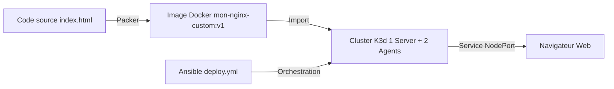
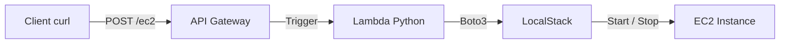

# 🧪 Ateliers DevOps — Infrastructure as Code & Automation


Ce dépôt regroupe **deux ateliers DevOps complémentaires**, orientés *Infrastructure as Code*, automatisation et environnements reproductibles via **GitHub Codespaces**.

---

# 🐳 Atelier 1 — From Image to Cluster


## 🎯 Objectif

Industrialiser le cycle de vie complet d’une application **Nginx**, depuis la construction d’une image immuable jusqu’à son déploiement automatisé sur un cluster Kubernetes local.

---

## 🏗️ Architecture & workflow



---

## 🚀 Déploiement automatisé

```bash
make all
```

**Pipeline exécuté :**

* Installation des dépendances
* Création du cluster K3d
* Build de l’image avec Packer
* Déploiement Kubernetes via Ansible

---

## 🌐 Accès à l’application

```bash
kubectl port-forward svc/nginx-service 8081:80
```

➡️ Ouvrir le navigateur → **MISSION RÉUSSIE**

---

## 📂 Structure — Atelier 1

```plaintext
.
├── Makefile
├── deploy.yml
├── index.html
└── template.pkr.hcl
```

---

# ☁️ Atelier 2 — API-Driven Infrastructure


## 🎯 Objectif

Piloter dynamiquement des ressources **EC2 simulées** via une **API REST Serverless**, sans aucune interaction manuelle avec une console AWS.

L’environnement AWS est entièrement simulé localement grâce à **LocalStack**.

---

## 🏗️ Architecture technique



---

## 🚀 Installation & déploiement

### Démarrage de l’environnement

```bash
make all
```

* Installation des outils (awscli, localstack, jq)
* Démarrage du conteneur LocalStack
* Configuration AWS factice

### Déploiement de la stack

```bash
make deploy
```

➡️ L’URL de l’API est affichée automatiquement

---

## 🎮 Utilisation de l’API

### Stop de l’instance

```bash
curl -X POST http://127.0.0.1:4566/restapis/<API_ID>/prod/_user_request_/ec2 \
  -H 'Content-Type: application/json' \
  -d '{"instance_id": "<INSTANCE_ID>", "action": "stop"}'
```

### Start de l’i
