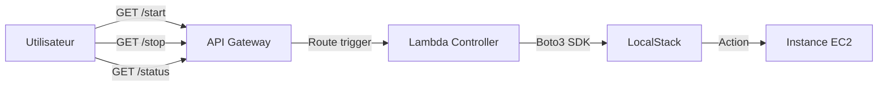

# ☁️ API-Driven Infrastructure — Serverless Controller


---

## 🎯 Objectif du projet

Ce projet met en œuvre une **infrastructure pilotée par API**, suivant les principes de l’**Infrastructure as Code (IaC)** et du **Serverless**.

Il permet de **contrôler une instance EC2 simulée** (démarrage, arrêt, statut) via de simples **requêtes HTTP**, sans aucune interaction avec la console AWS.

L’environnement AWS est **entièrement simulé en local** grâce à **LocalStack**, exécuté dans un **GitHub Codespace**.

---

## 🏗️ Architecture

L’architecture repose sur un contrôleur Serverless exposant plusieurs endpoints REST :



---

## ⭐ Points forts techniques

* **Architecture multi-endpoints REST** : routes distinctes `/start`, `/stop` et `/status`
* **Contrôleur Serverless unique** : une Lambda gère toute la logique de routage
* **Fix réseau Docker** : communication Lambda ↔ LocalStack via l’IP passerelle `172.17.0.1`
* **Auto-discovery** : génération automatique des URLs publiques selon l’environnement (Local / Codespaces)

---

## 🚀 Installation & démarrage (automatisé)

L’intégralité du cycle de vie est pilotée par un **Makefile**, garantissant reproductibilité et simplicité.

### ▶️ Initialisation de l’environnement

```bash
make all
```

Cette commande :

* installe les dépendances nécessaires
* démarre le conteneur Docker LocalStack
* prépare l’environnement AWS simulé

➡️ Attendre le message : **"Environnement AWS simulé est PRÊT"**

---

### 🚢 Déploiement de l’infrastructure

```bash
make deploy
```

Cette étape crée :

* l’instance EC2 simulée
* la fonction Lambda
* l’API Gateway et ses routes

🏁 À la fin du déploiement, **trois URLs publiques HTTPS** sont affichées dans le terminal.

---

## 🎮 Utilisation

Deux méthodes sont possibles pour piloter l’infrastructure.

### 🌐 Via le navigateur

Utilisez directement les URLs générées lors du déploiement :

* **Démarrer l’instance** : `https://.../start`
* **Arrêter l’instance** : `https://.../stop`
* **Vérifier le statut** : `https://.../status`

---

### ⌨️ Via le terminal (commandes Make)

Le Makefile expose des raccourcis intelligents :

```bash
make ec2-start
make ec2-stop
make ec2-status
```

Ces commandes appellent directement l’API REST et affichent la réponse.

---

## 📂 Structure du projet

```plaintext
.
├── Makefile               # 🤖 Orchestrateur (install, deploy, commandes)
├── infrastructure/
│   └── setup.sh           # ⚙️ IaC : création des ressources et routing API
└── lambda/
    └── lambda_function.py # 🧠 Logique Python (routes + boto3)
```

---

## 🧹 Nettoyage

Pour supprimer toutes les ressources et arrêter les conteneurs :

```bash
make clean
```

---

✨ **API first. Serverless control. Infrastructure automated.**
